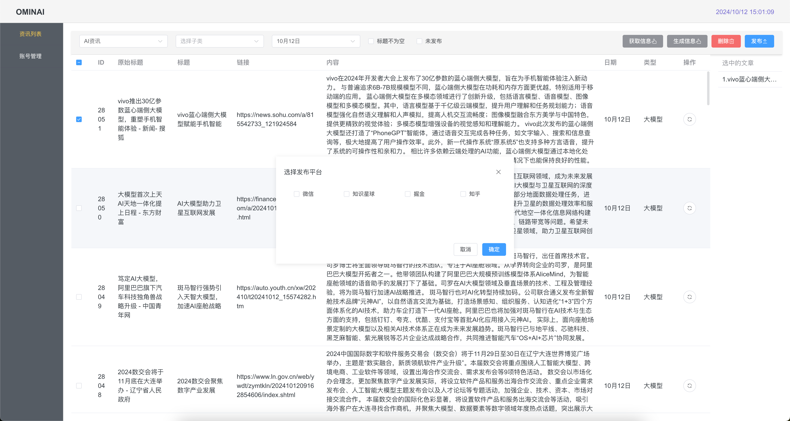

# OminiNewsAI
### 简介

AI自动新闻采集多平台发布工具【万能新闻助手】

根据关键字 自助抓取新闻资讯、AI总结洗稿内容、一键发布多平台。

目前只支持文本类，平台目前支持微信公众号、掘金、知识星球、知乎 一键发布。

### 后续计划

1.增加模版类型

2.多租户、目前只是处于能用设计的不太好，需要调整支持多租户，这样就方便直接注册使用了。

3.增加图文、短视频

4.自动采集图片/AI自动生成图片/短视频

5.增加B站，视频号、抖音、快手、小红书、西瓜等短视频平台

6.增加多账号支持、实现矩阵。

自从ChatGPT爆火之后，一直关注AI行业、搜集AI资讯、整理最新资讯、发布到公众号、知乎、掘金、知识星球等。

每天占用大量的时间去总结资讯、包括挑选资讯、多平台发布。就考虑实现一个AI自主总结，毕竟这是大模型最擅长的功能。

### UI展示 和 管理后台

**AI搜索**

**登陆后的管理后台**

地址：https://ominiai.cn

### 原理

1.获取资讯方式可以多样爬虫、或者RSS订阅资讯频道；

我是用的是利用Google Alert 订阅关键词。

https://www.google.com/alerts# 支持RSS 或者邮件订阅

邮件订阅挺好的，但是有一段时间使用的微软邮箱。POP3出问题了就直接换成了RSS订阅。

2.解析标题和内容，根据URL 解析标题和内容。

3.使用AI大模型对内容进行总结。

4.生成模版，根据内容对模版填充。

5.适配平台并发布。

### 参数说明

*# 多个 Google Alerts RSS Feed URL*

RSS_FEED_URLS = [ ] 中存放RSS订阅，如果不用RSS方式就修改为 邮件方式。

### 部署方式

我是直接部署了一个网页展示、另外本地电脑部署了一个定时任务去解析资讯。

### 大模型 API

AI的总结API 我是自己使用的Groq的可以提供免费AI API 但是容易封号。自己可以申请试试。

也可以使用我自己搭建的API中转（有一些费用、因为封号重新注册有成本）

ai.ominiai.cn

### 需要修改的地方

1.模版，模版中有一些我公众号信息，需要替换成你的。

2.api key apikey 默认使用的ai.ominiai.cn，如果你有其他渠道可以换成其他渠道。

3.登陆账号密码 数据库密码等。

